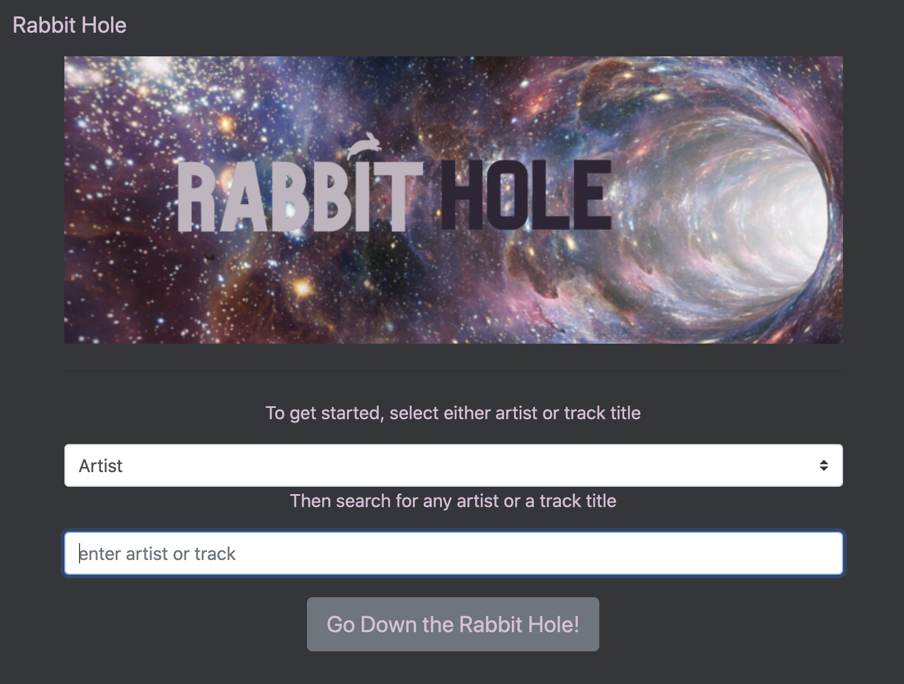

# Rabbit Hole

## Description

An application the allows music lovers and knowledge seekers alike to expand upon their interests and be a discoverer of new music and related information. You can search for an artist or music track you love and you will be presented with your search results. You can then *go down the rabbit hole* by discovering related artists and and books based on your search. You will also be able to save your search for future reference. 

The following image shows a glimpse of the application:

## Getting Started

This is a simple application that requires a login using an email and password. Feel free to use the following login:

email: ***test@test.com***  
password: ***test***

## Built With:

MySQL & Sequelize - database 
Express - Server 
JQuery - Javascript Library 
Handlebars - Templating Language 
Node.js - JavaScript Runtime

## Authors:
Natalie McKee  
Manuel Quispe 
Melissa Elie
 

## Planned Updates

Planned updates include adding the ability to play a sample of the searched track.
